# Dawid-Skene server-side feasibility and controlled experiment plan

Status: design and pseudocode only

Branch: `dawid-skene`

Proposed variant name: **SSFL-DS consensus**

Decision state: feasible for a controlled extension; not approved as a new default

## 1. Executive verdict

Implementing Dawid-Skene (DS) at the SSFL server is technically feasible with a narrow change at
the current hard-label aggregation seam. The clients already upload the observations DS needs: one
class label per shared open sample, with `-1` used for abstention. The server can infer latent label
posteriors and client confusion matrices, then broadcast the same `global_labels` and `valid_mask`
arrays that the rest of the system already consumes.

The first experiment should be **server-only and opt-in**:

- Keep client training, discriminator filtering, payloads, and distillation unchanged.
- Treat `ABSTAIN=-1` as a missing observation, not as a twelfth class.
- Run DS in log space, deterministically, with explicit smoothing and a majority-vote fallback.
- Begin in shadow mode: compute DS from the exact same proposals while broadcasting the current
  majority result.
- Use sealed open-set labels only in an offline evaluator. They must never enter aggregation,
  training, threshold selection during an active run, or fallback logic.
- Promote to active A/B runs only after numerical, latency, and held-out label-quality gates pass.

Feasibility summary:

| Dimension | Assessment | Reason |
|---|---|---|
| Code integration | High | `SSFLStrategy.aggregate_train` already selects one isolated aggregator. |
| Wire compatibility | High | Existing hard-label uplink and label/mask downlink can remain identical. |
| Memory | High | Compact state is only a few MiB at 89 clients, 8,900 items, and 11 classes. |
| Runtime | Medium | Worst-case EM work is large across 200 rounds; it must be benchmarked and capped. |
| Statistical fit | Medium | Shared models are correlated and discriminator abstention is not missing-at-random. |
| Paper fidelity | Partial | This plan adapts DS for pseudo-label consensus; the paper uses it for model weighting. |
| Privacy | Medium-high | No new wire data, but per-client reliability/confusion audits are sensitive. |

## 2. What is taken from the 2026 paper, and what is adapted

Reference: J. Dong, R. Zhu, X. Shang, and J.-H. Xue, "Dawid-Skene-model-based label-noise
mitigation for federated learning," *Information Sciences* 745 (2026) 123425,
doi:10.1016/j.ins.2026.123425.

The paper's FedDS method (Fig. 2; Sections 3.1-3.3, pp. 2 and 4-6) does the following in every
federated round:

1. Clients upload trained model parameters.
2. The server runs each client model over a shared unlabeled public dataset.
3. DS estimates a confusion matrix for each client and a latent label posterior for each public
   sample.
4. Client reliability is `trace(confusion_matrix) / number_of_classes`.
5. Those reliabilities replace the usual weights in model-parameter aggregation.

This repository's SSFL protocol intentionally does not upload client model parameters. Clients
already predict the shared open set and upload filtered hard pseudo-labels. Therefore this plan is
an explicit adaptation:

| Concern | Paper FedDS | Proposed SSFL-DS consensus |
|---|---|---|
| Client upload | Model parameters | Existing `pseudo_labels[int8, N]` |
| Where public inference runs | Server | Existing client proposal phase |
| DS output used for | Client model-aggregation weights | Global pseudo-label MAP estimate |
| Downstream action | Weighted global model | Existing label broadcast and distillation |
| Missing predictions | Not modeled | `ABSTAIN=-1` treated as missing |
| Communication effect | Model-upload protocol | No change from current hard-label SSFL |

This variant must be reported as **SSFL-DS consensus**, with `run_kind: extension`. It must not be
called a reproduction of FedDS. A literal FedDS implementation would be a separate major protocol
change involving model upload, server-side client-model inference, model aggregation, and a new
privacy/communication review.

The paper specifies the E-step and M-step (Eqs. 9-11), but does not specify initialization,
convergence tolerance, the default iteration count used in its main tables, smoothing, missing
labels, warm starts, failure handling, or operational label-permutation resolution. Those choices
are therefore first-class experimental variables below rather than hidden implementation details.

Paper settings are reference anchors, not defaults for this N-BaIoT repository:

| Paper Section 5.1 setting | Value |
|---|---|
| Datasets | MNIST, CIFAR-10, CIFAR-100 |
| Public split | Stratified 10% of original training data |
| Federation | 100 clients; 10 randomly selected per round |
| Rounds / local epochs | 100 / 5 |
| Optimizer | SGD, learning rate 0.01, momentum 0.9 |
| Batch size | 64 |
| Non-IID settings | Dirichlet alpha 0.5 and 10 |
| Symmetric client noise | Client rate drawn from `{0.1, 0.2, ..., 1.0}` |
| Main reporting convention | Mean global test accuracy over final 10 rounds |
| EM iteration ablation | 50, 100, 500, 1,000 |

The paper does not report seeds, repeated-run uncertainty, a default EM iteration count for its
main tables, or measured DS timing/memory. This plan adds those missing controls.

## 3. Proposed server flow

```mermaid
flowchart LR
    subgraph Clients["Clients - unchanged"]
        A["1. Train persistent classifier<br/>on private labelled data"]
        B["2. Predict the shared<br/>8,900-sample open set"]
        C["3. Discriminator / threshold<br/>marks familiar samples"]
        D["4. Upload aligned hard labels<br/>class 0..10; -1 = abstain"]
        A --> B --> C --> D
    end

    subgraph Server["Central server - new consensus choice"]
        E["5. Validate sender, manifest,<br/>shape, range, and duplicates"]
        F[("Client x sample<br/>annotation matrix Y")]
        G["6. Smoothed-vote initialization<br/>biases semantic class alignment"]
        H["7. E-step in log space<br/>latent label posterior Q"]
        I["8. M-step<br/>class prior + client confusion matrices"]
        J{"Converged?"}
        P{"Iteration cap<br/>reached?"}
        K["9. Posterior argmax<br/>plus preregistered acceptance gate"]
        L["10. Save DS diagnostics<br/>and majority comparison"]
        M["11. Broadcast existing<br/>global_labels + valid_mask"]
        N["12. Existing client/server<br/>distillation and evaluation"]
        R["Deterministic majority vote<br/>fallback / shadow broadcast"]

        E --> F --> G --> H --> I --> J
        J -- "yes" --> K --> L --> M --> N
        J -- "no" --> P
        P -- "no" --> H
        P -- "yes - policy fallback" --> R
        E -- "insufficient valid input" --> R
        H -- "non-finite / invariant failure" --> R
        I -- "non-finite / invariant failure" --> R
        R --> L
    end

    D --> E
```



Only the server aggregation block changes. The client uplink and label/mask downlink retain the
same tensor schema and logical array byte counts as the current hard-majority arm. Serialized message
bytes are measured separately because existing scalar values can change once active DS alters the
training trajectory; no DS state may be added to the wire payload.

## 4. Repository fit and exact change map

Current dimensions from the seed-2023 manifest:

| Quantity | Value |
|---|---:|
| Open samples `N` | 8,900 |
| Classes `C` | 11 |
| Scenario 1 clients | 27 |
| Scenario 2 clients | 89 |
| Scenario 3 clients | 89 |
| Open class counts | 900 each for classes 0-5; 700 each for classes 6-10 |
| Manifest hash | `54023e3de197d9dc16f50a89425d5c44bb594486210aacf16ecaa8cccc86ba65` |

The graph trace identifies one production caller of `aggregate_votes`:
`src/ssfl/strategies/ssfl.py::SSFLStrategy.aggregate_train`. The downstream contract is already
exactly what the adapted DS method should return.

Planned implementation points:

| File / symbol | Planned responsibility |
|---|---|
| `src/ssfl/protocols/dawid_skene.py` | Pure NumPy DS estimator, options, result, invariants, and deterministic fallback signal. |
| `src/ssfl/protocols/ssfl.py` | Adapter from validated `ProposalResult`s to a sender-sorted annotation matrix and existing `AggregationResult`. |
| `src/ssfl/config.py::ExperimentConfig` | Add an opt-in hard-label aggregation mode and fully resolved `dawid_skene_*` fields. |
| `src/ssfl/strategies/ssfl.py::SSFLStrategy.aggregate_train` | Select majority, DS shadow, or active DS; write safe diagnostics. |
| `src/ssfl/server_app.py::main` | Pass resolved DS options to `SSFLStrategy`; keep client and distillation paths unchanged. |
| `src/ssfl/metrics.py` | Add a resume-aware `AggregationDiagnosticsLedger`, created in `server_app.main` and injected into the strategy; do not rely only on Flower's returned `MetricRecord`. |
| `src/ssfl/reporting/build_report.py` | Keep extension runs out of canonical SSFL cells and build a separate feasibility comparison. |
| `tests/protocol/test_dawid_skene.py` | Closed-form, synthetic, missing-label, determinism, convergence, and fallback tests. |
| Existing SSFL/config/privacy/report tests | Prove unchanged payloads, valid combinations, resume behavior, and report separation. |

Recommended configuration shape:

```yaml
run_kind: extension
ssfl_label_representation: hard
ssfl_voting_mode: enabled
ssfl_hard_aggregation: dawid_skene_shadow  # majority | dawid_skene_shadow | dawid_skene

dawid_skene_max_iterations: 100
dawid_skene_min_iterations: 2
dawid_skene_tolerance: 1.0e-6
dawid_skene_initialization: smoothed_votes
dawid_skene_initialization_pseudocount: 0.01
dawid_skene_initial_diagonal_probability: 0.9  # only for near_diagonal initialization
dawid_skene_confusion_pseudocount: 0.1
dawid_skene_class_prior_pseudocount: 1.0
dawid_skene_min_item_annotations: 1
dawid_skene_min_client_annotations: 1
dawid_skene_min_clients: 3
dawid_skene_posterior_threshold: 0.0
dawid_skene_warm_start: false
dawid_skene_damping: 1.0
dawid_skene_epsilon: 1.0e-12
dawid_skene_internal_dtype: float64
dawid_skene_failure_policy: majority_on_failure_or_nonconvergence
dawid_skene_save_annotations: false
dawid_skene_full_audit_rounds: [1, 10, 50]  # 200-round profile adds 100, 150, 200
```

These are candidate feasibility defaults, not claimed paper defaults. The locked confirmatory
values must be selected only through the preregistered shadow-screening procedure.

## 5. Required algorithm semantics

### 5.1 Observation model

Build `Y[client, sample]` from validated hard proposals in sorted sender order.

- Valid observations are integers in `[0, C)`.
- `-1` is missing and never becomes a modelled class.
- Conflicting duplicate payloads from one sender cause that sender to be rejected; identical
  retries are accepted once and recorded. This policy is deterministic under arrival reordering.
- All-abstain samples remain `global_label=-1` and `valid_mask=False`.
- Items below `min_item_annotations` may inform neither the estimator nor the broadcast decision,
  as specified by the locked experiment configuration.
- Clients below `min_client_annotations` are excluded from estimation and recorded, not silently
  interpreted as perfectly unreliable.
- Fewer than `min_clients` eligible clients triggers the declared fallback; the candidate value is
  three because a two-view latent-class model is not generally identifiable.

The paper assumes complete observations. The missing-data M-step must therefore normalize each
client/class row using only items that client actually labelled.

### 5.2 Initialization and label identity

DS is label-permutation ambiguous. The primary deterministic initialization uses smoothed
per-sample vote proportions with the repository's existing semantic class indices. This biases EM
toward aligning latent class `c` with output class `c` without reading true open-set labels, but it
does not mathematically prevent label switching. The paper's identifiability result additionally
depends on diagonal dominance.

Initialization must be reported. A near-diagonal confusion initialization is a sensitivity arm,
not an invisible fallback. Random initialization is out of scope for the first experiment because
it adds restarts and another source of variance without solving the semantic mapping problem.

### 5.3 E-step

For item `i` and candidate true class `c`, sum log probabilities only over clients that labelled
that item:

```text
log_score[i,c] = log(class_prior[c])
               + sum_j_observed log(confusion[j,c,Y[j,i]])
posterior[i,:] = softmax(log_score[i,:])
```

Use `float64`, clipping at the configured epsilon, and log-sum-exp normalization. Do not multiply
raw probabilities.

### 5.4 M-step

Update the class prior from posterior expected counts plus its pseudocount. For every client,
candidate true class, and observed label, update the confusion probability from posterior-weighted
counts over that client's non-abstained items plus the configured pseudocount. Every probability
vector must be finite, non-negative, and normalized after each update.

### 5.5 Stopping and failure

Stop after `min_iterations` when the relative improvement of the declared regularized objective is
at most `tolerance`, or at `max_iterations`. Because the M-step adds pseudocounts, the monotonic
quantity must be the observed-data log-likelihood plus the matching Dirichlet log-prior terms, not
an unnamed raw likelihood. Record both raw log-likelihood and regularized objective, the full stop
reason, and the actual iteration count.

With the candidate `majority_on_failure_or_nonconvergence` policy, fall back to current
deterministic majority vote when any of these occurs:

- no estimable observations or too few eligible clients;
- a non-finite prior, posterior, confusion value, or objective;
- a normalization invariant fails;
- the regularized objective decreases beyond numerical tolerance;
- the configured non-convergence policy requires fallback at the iteration cap.

Fallback must be visible in round metrics and audit output. It must never silently reuse stale
labels from a previous round.

If no valid proposal is received, returning `(None, None)` is unsafe because Flower can leave the
previous round's arrays in place. Emit an explicit all-`ABSTAIN` label vector and all-false mask,
record `aggregation_status=no_proposals`, and let existing client/server distillation skip the
empty target set.

### 5.6 Output and downstream isolation

The primary active experiment broadcasts hard MAP labels only:

```text
candidate_label = lowest_index_argmax(posterior[i])
valid = observation_count[i] >= min_item_annotations
        and max(posterior[i]) >= posterior_threshold
```

The primary comparison uses `posterior_threshold=0.0` and `min_item_annotations=1` so DS does not
gain by reducing coverage. Thresholded selective labelling is a later ablation. Broadcasting soft
DS posteriors is also later work because it would change payload size and distillation loss,
confounding the aggregator comparison.

## 6. Complexity and feasibility benchmark

Compact approximate float64/int8 state at the largest scenario:

| Array | Shape | Approximate size |
|---|---:|---:|
| Annotations | `89 x 8,900` int8 | 0.76 MiB |
| Posterior | `8,900 x 11` float64 | 0.75 MiB |
| Client confusion matrices | `89 x 11 x 11` float64 | 0.08 MiB |
| Naive client-item-class temporary | `89 x 8,900 x 11` float64 | 66.5 MiB |

The naive temporary is avoidable and should not be materialized. Use indexed gathers,
`bincount`, and chunking if profiling shows memory pressure.

Approximate work per iteration is `O(N * J * C)`:

| Scenario | Approx. contributions / full E+M iteration | At 100 iterations | At 500 iterations |
|---|---:|---:|---:|
| 1: 27 clients | 5.29 million | 529 million | 2.64 billion |
| 2/3: 89 clients | 17.42 million | 1.74 billion | 8.71 billion |

`N * J * C` is about 2.64 million in scenario 1 and 8.71 million in scenarios 2/3 for
each dominant pass; a full EM iteration has both an E and an M pass. Actual optimized operations
and wall time must be measured rather than inferred from these upper-level counts.

The paper studies 50, 100, 500, and 1,000 iterations (Section 5.4.4, pp. 10-11), but its scale and
protocol differ. Here, actual convergence and latency must be measured. `max_iterations=100` is a
safe starting ceiling for live shadow runs; 50/100/500 should be screened offline. The 1,000-step
arm is allowed only after a scenario-sized benchmark shows it is affordable.

## 7. Controlled experiment design

### 7.1 Causal question and hypotheses

Primary causal question: in shadow/offline analysis, with the exact same hard proposals, does DS
MAP consensus improve pseudo-label quality over deterministic majority? In active longitudinal
runs, does assigning the same initial state, configuration, seed block, and infrastructure to both
arms improve downstream server classification without unacceptable runtime or new class collapse?
After the first active DS broadcast, proposals are a mediator and are not expected to remain
identical between arms.

Preregistered hypotheses:

- **H1 - aggregator quality:** DS improves held-out open-set macro-F1 at matched coverage.
- **H2 - downstream quality:** active DS improves final-10-round server macro-F1; final-10 accuracy
  is co-primary for comparability with the paper.
- **H3 - class robustness:** DS improves worst-class recall and the known gafgyt TCP/UDP collapse
  without creating a new collapsed class.
- **H4 - systems:** DS adds no new wire arrays or schema fields and has acceptable server
  aggregation overhead. Serialized protobuf byte counts may vary slightly with scalar values and
  must be reported rather than assumed bit-identical.

A scenario-seed run is the paired measurement unit, never an item or round. Scenario is a fixed
repeated condition; for the overall confirmatory estimand, seed is the independent inference block
after averaging its three scenario-specific deltas.

### 7.2 Locked controls

Unless a named ablation says otherwise, both arms must share:

| Control | Locked repository value |
|---|---|
| Dataset | Prepared N-BaIoT manifest, exact hash recorded |
| Open/private/test | 8,900 / 62,300 / 17,800 |
| Classes | 11 |
| Scenarios | 1, 2, 3 with 27 / 89 / 89 clients |
| Participation | All structural clients each round, as current `SSFLStrategy` does |
| Backbone | CNN |
| Rounds | 200 for confirmation |
| Local epochs | 5 |
| Optimizer | Fresh Adam per task, persistent model weights |
| Learning rate | `1e-4` |
| Batch size | 80 |
| Filter | Discriminator enabled, median threshold |
| Label payload | Hard `int8`, existing abstention semantics |
| Determinism | Enabled; sender-sorted server reductions |
| GPU allocation | Same device, 0.125 GPU/client, 8 concurrent clients |
| Initial models | Same seeded checkpoints |
| Checkpoints | Every round; pinned 10/50/100/150/200 |
| Environment | Same commit, lockfile, drivers, hardware, and recorded snapshot |
| Pair identity | Explicit block/pair ID for every scenario-seed arm |
| Runtime events | Actual participation, retries, failures, and node-to-logical-client mapping recorded |
| Code state | Clean committed worktree required for experiment runs |

The only active-arm difference is `ssfl_hard_aggregation` and its locked DS settings. Run order
should be randomized or interleaved by scenario-seed pair to reduce resource/thermal drift.

### 7.3 Staged matrix

#### Phase 0 - algorithm gate, no federated training

Use exact small fixtures and seeded synthetic annotators:

- hand-computed one E/M iteration;
- perfect and identical annotators;
- heterogeneous reliable/unreliable annotators;
- adversarial label flippers;
- class imbalance and absent classes;
- missing-at-random and class-dependent abstention;
- one annotator, sparse annotators, and all-abstain items;
- duplicate senders and every proposal order;
- exact MAP ties;
- forced non-convergence and non-finite fallback.

Gate: normalized finite probabilities within `1e-8`, non-decreasing objective within numerical
tolerance, deterministic order independence, correct missingness, and no NaN/Inf.

#### Phase 1 - online shadow and offline screening

Broadcast current majority labels while computing DS from the identical proposal batch.

| Factor | Values |
|---|---|
| Scenarios | 1, 2, 3 |
| Seed | 2023 |
| Rounds | 50 |
| Active output | Majority/index |
| Shadow output | DS plus diagnostics |
| Runs | 3 |

Existing aggregation audits store vote totals but not the client-by-sample matrix, so old runs
cannot be replayed through DS. A research-only audit flag must retain the sender-sorted annotation
matrix for selected shadow rounds. Per-client artifacts require restricted retention.

Use this exact screening split and publish the mapping before reading its scores:

- Development proposals: scenario 1, seed 2023, rounds `{1, 5, 10, 15, 20, 25}`.
- Development items: hash buckets 0-1 from
  `SHA256(manifest_hash || ":" || global_open_index) mod 5` (40% of items).
- Validation proposals: scenario 1 rounds `{30, 35, 40, 45, 50}` and scenarios 2 and 3 rounds
  `{1, 10, 25, 35, 50}`.
- Validation items: hash buckets 2-4 (60% of items).
- Active-run test metrics are never a tuning signal.

Use this exact 12-configuration one-factor screen; all unspecified fields stay at the candidate
values in Section 8:

| ID | Single change from candidate configuration |
|---|---|
| DS-00 | Candidate: 100 iterations, tolerance `1e-6`, smoothed votes, init `0.01`, confusion `0.1`, prior `1.0` |
| DS-01 | Maximum iterations 50 |
| DS-02 | Maximum iterations 500 |
| DS-03 | Tolerance `1e-4` |
| DS-04 | Tolerance `1e-8` |
| DS-05 | One-hot majority initialization |
| DS-06 | Near-diagonal confusion initialization with diagonal probability 0.9 |
| DS-07 | Initialization pseudocount `0.001` |
| DS-08 | Initialization pseudocount `0.1` |
| DS-09 | Confusion pseudocount `0.01` |
| DS-10 | Confusion pseudocount `1.0` |
| DS-11 | Class-prior pseudocount `0.1` |

For all 12, lock minimum item annotations to 1, minimum client annotations to 1, minimum clients to
3, posterior threshold to 0.0, damping to 1.0, and warm start to false. This prevents the screening
winner from gaining macro-F1 merely by reducing coverage.

Selection rule, in order: highest development open-label macro-F1; then highest worst-class recall;
then lower median DS runtime; then fewer maximum iterations; then lower configuration ID. A failed
or fallback-producing configuration is ineligible. Evaluate the single selected configuration once
on the validation split. If it misses the shadow gate, stop or preregister a new experiment; do not
retune on validation. Publish all 12 attempted configurations and results.

Warm start remains `false` in the first study. Client error rates evolve across rounds, and the
current sender identity is a Flower node ID rather than a proven stable logical-client identity
across resume. Configuration validation must reject `dawid_skene_warm_start=true` in this first
implementation rather than silently ignoring it. Warm start is a separate later experiment after
identity and resume-state semantics are fixed.

#### Phase 2 - active paired pilot

Lock all DS settings before this phase.

| Aggregator | Scenarios | Seeds | Rounds | Runs |
|---|---:|---:|---:|---:|
| Majority/index | 1, 2, 3 | 2023, 2024, 2025 | 50 | 9 |
| Locked DS | 1, 2, 3 | 2023, 2024, 2025 | 50 | 9 |

Total: 18 paired exploratory runs. The planned confidence tie-break can be added later as nine
separate runs, but it must not be mixed into the primary majority-vs-DS decision.

#### Phase 3 - full confirmation

After the pilot passes and no parameter is changed:

| Aggregators | Scenarios | Seeds | Rounds | Total runs |
|---|---:|---:|---:|---:|
| Majority and locked DS | 1, 2, 3 | 2026, 2027, 2028, 2029, 2030, 2031, 2032, 2033, 2034, 2035 | 200 | 60 |

The confirmation seeds are disjoint from screening/pilot seeds 2023-2025. If only three seeds are
affordable, use 18 runs and label the evidence exploratory. The primary confirmation keeps the
prepared seed-2023 manifest fixed. Varying the data-preparation seed is a separate post-confirmation
replication factor, with each majority/DS pair sharing its matched manifest; it must not be mixed
into the primary estimand.

For each metric, first compute the final-10 DS-minus-majority delta inside each scenario-seed pair.
Analyze each scenario separately. For the overall effect, average the three scenario deltas within
each seed and treat the ten seeds as the independent blocks; do not treat the 30 scenario-seed
cells as independent. The two co-primary outcomes form a conjunctive decision: both macro-F1 and
accuracy must pass their declared effect/non-inferiority gates. Report a one-sided exact paired
sign-flip test and a seed-block bootstrap interval for each, while explicitly noting the low power
of ten blocks. No multiplicity adjustment is used for adoption because success requires both
co-primaries, not either one. Scenario-specific intervals are descriptive and are not additional
confirmatory claims.

#### Phase 4 - interaction ablations, only after confirmation

- discriminator mode: enabled, disabled, simple filter;
- minimum item annotations: 1, 2, 3;
- minimum client annotations: 1, 11, 50;
- posterior threshold: 0.0, 0.5, 0.7;
- damping: 1.0 versus 0.5;
- cold start versus a separately designed stable-identity warm start;
- optional majority plus confidence tie-break comparator;
- optional hard MAP versus soft-posterior distillation, reported as a different protocol.

## 8. Hyperparameters and required reporting

Every field below must appear in `resolved_config.yaml`, the run ID/config hash, and the report.

| Field | Candidate start | Role / reporting requirement |
|---|---:|---|
| `ssfl_hard_aggregation` | `majority` | `majority`, `dawid_skene_shadow`, or `dawid_skene`; never infer from profile name. |
| `dawid_skene_max_iterations` | 100 | Hard runtime ceiling; report actual iteration distribution. |
| `dawid_skene_min_iterations` | 2 | Prevent a false convergence declaration at initialization. |
| `dawid_skene_tolerance` | `1e-6` | Relative objective-improvement threshold. |
| `dawid_skene_initialization` | `smoothed_votes` | Biases class alignment; report, sensitivity-test, and diagnose switching. |
| `dawid_skene_initialization_pseudocount` | `0.01` | Avoid zero initial posteriors. |
| `dawid_skene_initial_diagonal_probability` | `0.9` | Used only by the declared near-diagonal screening arm. |
| `dawid_skene_confusion_pseudocount` | `0.1` | Avoid zero confusion entries/rows. |
| `dawid_skene_class_prior_pseudocount` | `1.0` | Avoid collapsed/zero class priors. |
| `dawid_skene_min_item_annotations` | 1 | Primary value matches majority coverage. |
| `dawid_skene_min_client_annotations` | 1 | Exclusion rule for sparse clients; report excluded clients/support. |
| `dawid_skene_min_clients` | 3 | Identifiability/support gate before fitting; otherwise use visible fallback. |
| `dawid_skene_posterior_threshold` | `0.0` | Primary value prevents selective-coverage advantage. |
| `dawid_skene_warm_start` | `false` | Required in the first implementation; reject `true` until logical-client and resume-state semantics are defined. |
| `dawid_skene_damping` | `1.0` | Full M-step; lower only under preregistered instability handling. |
| `dawid_skene_epsilon` | `1e-12` | Log/clipping safeguard, not a substitute for smoothing. |
| `dawid_skene_internal_dtype` | `float64` | Numerical stability and deterministic reference behavior. |
| `dawid_skene_failure_policy` | `majority_on_failure_or_nonconvergence` | Fail closed on invalid state or iteration-cap nonconvergence and record why. |
| `dawid_skene_save_annotations` | `false` | Enable only for restricted shadow research audits. |
| `dawid_skene_full_audit_rounds` | sorted unique tuple | Limit posterior/confusion storage volume with stable config hashing and range validation. |

Also report all existing controls: manifest hash, data seed, run seed, partition/scenario, client
count and participation, open/test sizes, class counts, model/backbone, initialization checkpoint,
optimizer, learning rate, epochs, batch size, threshold/discriminator modes, rounds, deterministic
settings, hardware, dependency versions, block/pair ID, actual participation, all RNG seeds,
node-to-logical-client mapping, retry/resume state, and git dirty state. Confirmation requires
`git_dirty=false`.

## 9. Metrics and artifacts

### 9.1 Aggregator quality - offline only

The evaluator may join results to `artifacts/data/audit/source_rows.parquet` after the run. Training
and live aggregation may not import it.

Report:

- pseudo-label accuracy and macro/micro/weighted precision, recall, and F1;
- per-class confusion, recall, F1, and valid coverage;
- accuracy at matched coverage: evaluate both methods on their common valid support, and for
  selective Phase-4 curves compare the top-`k` items where `k` is the smaller valid count, ranked
  by DS posterior confidence or majority winning-vote share;
- majority/DS disagreement rate;
- corrected flips, newly corrupted flips, and net corrections;
- tie-subset and non-tie-subset results;
- posterior negative log-likelihood, multiclass Brier score, entropy, and 15-bin equal-frequency
  expected calibration error, computed only on estimable items (never prior-filled invalid rows);
- predicted class distribution and class-prior error on the estimable subset;
- item annotator-count distribution;
- estimated client confusion versus audit-only empirical confusion;
- estimated reliability versus empirical balanced accuracy conditional on non-abstention, with
  rank correlation and per-class support;
- effective client/class support and diagonal-dominance diagnostics.

### 9.2 Downstream learning

Co-primary outcomes:

1. mean server macro-F1 over the final 10 rounds;
2. mean server accuracy over the final 10 rounds, matching the paper's reporting convention.

Secondary outcomes:

- worst-class recall, defined as `min_class(mean(last_10_round_recalls_for_class))`, and per-class F1;
- macro/micro/weighted precision and recall;
- final and best metrics;
- area under the round-metric curve;
- rounds to 50% and 75% accuracy, analyzed as right-censored when a run never reaches the target
  (report reached proportion and Kaplan-Meier/time-to-event summary; never substitute round 200);
- training/evaluation loss and valid-label rate;
- raw and normalized test confusion matrices.

For each scenario, report every seed, run-level mean and standard deviation, paired deltas, a paired
block/bootstrap 95% interval, and the count of positive scenario-seed pairs. Never treat 200 round
rows as 200 independent replicates. The overall result is the equal-scenario mean within each seed,
not a sample-count-weighted mean.

Define a **new class collapse** as a class with nonzero test support whose DS final-10 mean recall is
below 5% while the matched majority recall is at least 20%. Report every class below 5% in either
arm even when it is not new.

Primary analysis is intention-to-treat: every configured DS round, including majority-fallback
rounds, remains in the DS arm. A fallback-free sensitivity analysis may be secondary. Infrastructure
failures may rerun only the identical scenario-seed pair after the cause is recorded; numerical,
convergence, or poor-model outcomes are algorithmic and may not be replaced. Confirmation requires
all paired arms; unresolved missing pairs are reported and block adoption rather than silently
changing seeds.

### 9.3 Systems, convergence, and privacy

- EM iterations, stop reason, raw log-likelihood, regularized objective start/end, relative change,
  and monotonicity of the declared regularized objective;
- convergence/fallback count and reasons;
- aggregation latency p50/p95/max and share of total round duration;
- peak RSS, temporary allocation, and audit storage;
- annotation coverage and excluded clients/items;
- logical, serialized, and paper-equivalent communication bytes;
- exact equality of hard-label uplink and label/mask downlink array schemas and logical byte counts;
- serialized-byte deltas, which may vary with scalar values but must contain no new DS payload;
- resume/retry identity and duplicate-reply handling.

Recommended additions:

| Artifact | Contents |
|---|---|
| `aggregation_metrics.parquet` | Round, mode, participation, convergence, iterations, raw log-likelihood, regularized objective, entropy, timing, fallback, disagreement. |
| `dawid_skene_clients.parquet` | Restricted round/client reliability, support, and confusion summaries. |
| `aggregation_quality.parquet` | Offline truth-based majority/DS comparisons, never read by training. |
| `aggregation_audit/*.npz` | Existing votes/labels/mask plus selected-round DS posterior, priors, confusions, and optional annotations. |

Current report selection primarily keys on algorithm/backbone/scenario. Both experiment arms remain
`algorithm=ssfl`, so reporting must add `run_kind` and `ssfl_hard_aggregation` to its identity and
must prevent an extension run from replacing a canonical SSFL paper cell.

Research-audit governance defaults:

- Persist raw sender-by-item annotations only in Phase 1. Use scenario-1 rounds
  `{1, 5, 10, 15, 20, 25, 30, 35, 40, 45, 50}` and scenario-2/3 rounds
  `{1, 10, 25, 35, 50}`, exactly matching the preregistered screen.
- Replace sender IDs with a run-scoped HMAC before persistence; keep the key outside the report
  bundle with owner-only permissions.
- Store compressed artifacts in an owner-only (`0700`) directory on an encrypted research volume.
  If encrypted storage is unavailable, compute the 12 variants online and do not persist raw
  annotations.
- Keep `dawid_skene_clients.parquet` and raw annotations outside the general report bundle.
- Delete raw annotations and the HMAC key within 30 days of locking Phase 1 settings, and record the
  deletion in the experiment ledger. The designated experiment owner is accountable for deletion.
- Retain aggregate, non-client-identifying quality summaries for reproducibility.

Attempt-local diagnostics are staging artifacts. After `on_round_end` commits the server checkpoint,
atomically promote that attempt/round's aggregation row and selected NPZ to a run-level canonical
location. On resume, truncate aggregation-ledger rows beyond the committed checkpoint and discard
uncommitted attempt files. This prevents duplicate or stale same-round audits.

## 10. Verification plan

### Unit/protocol properties

- hand-derived E-step and M-step values;
- posterior, prior, and confusion rows are finite and normalized;
- the regularized objective is non-decreasing within tolerance when pseudocount priors are active;
- `ABSTAIN` is missing, all-abstain stays invalid, and absent classes do not produce NaN;
- lowest-index output on exact posterior ties;
- bit-identical result under every sender/proposal order;
- duplicate sender idempotence and rejection audit;
- perfect unanimous labels recover unchanged labels;
- sparse/single annotator behavior follows the declared policy;
- forced iteration-cap/non-finite cases invoke visible majority fallback;
- synthetic reliability ranking tracks known annotator quality;
- label-alignment checks detect silent class permutations in test fixtures and synthetic stress
  cases.

### Configuration/report properties

- DS modes require hard labels and current voting-enabled path;
- invalid ranges and unsupported combinations fail before a run starts;
- every DS option changes the resolved config hash/run ID;
- canonical profiles keep majority behavior without modification;
- extension DS runs cannot populate or supersede canonical report cells;
- DS modes require `run_kind=extension`;
- final-10 summaries are computed as preregistered, not from only the last row.

### Integration/privacy properties

- two-round CPU shadow and active smoke runs complete;
- client and server distillation still consume only `global_labels` and `valid_mask`;
- communication tensor names, dtypes, shapes, and logical byte counts equal the majority arm;
- serialized messages contain no new DS field and any value-dependent byte delta is reported;
- live code cannot access sealed open labels;
- per-client DS audits are opt-in and excluded from general telemetry;
- shadow output and every active failure fallback are bit-identical to current majority output for
  valid unique-sender batches and identical retries; conflicting duplicates are deterministically
  rejected and tested separately;
- invalid prior-filled posterior rows are excluded from offline quality/calibration metrics;
- restricted annotation/client audit files are absent by default;
- resume reproduces the same round output and truncates uncommitted diagnostics;
- scenario-sized 27- and 89-client benchmarks measure latency and peak memory.

## 11. Preregistered decision gates

Suggested thresholds should be confirmed before running the experiment.

### Promote shadow to active pilot only if

- finite, invariant-valid DS output on every shadow round;
- convergence on at least 95% of rounds and no unexplained objective decrease;
- positive net label corrections in every scenario;
- held-out open-label macro-F1 improves by at least 1 percentage point at matched coverage;
- targeted tied/collapsed-class accuracy improves by at least 5 points;
- scenario-89 p95 DS compute time is both below 10% of total round time and below 5 seconds;
- audit serialization time is measured separately and does not count as DS compute time;
- logical byte-count delta is exactly zero, no DS field appears on wire, and any serialized-byte
  delta is below 1% and explained by existing scalar/value encoding.

### Promote pilot to full confirmation only if

- mean paired final-10 macro-F1 improves by at least 1 point;
- final-10 accuracy is non-inferior within -0.5 point overall;
- no scenario loses more than 1 macro-F1 point;
- at least 8 of 9 scenario-seed pairs improve macro-F1;
- worst-class recall improves without a new class collapse;
- fallback rate is below 1%;
- wall-clock overhead remains below 10%, logical byte counts remain unchanged, and no DS payload is
  added to serialized messages.

### Adopt after full confirmation only if

- the ten seed-block overall macro-F1 deltas have mean at least +1.0 point and pass the declared
  one-sided exact paired test at `alpha=0.05`;
- the ten seed-block overall accuracy deltas are non-inferior to -0.5 point and pass the declared
  one-sided exact paired non-inferiority test at `alpha=0.05`;
- both co-primary conditions pass (conjunctive rule), every seed/scenario result is disclosed, and
  no scenario loses more than 1 macro-F1 point;
- no new class collapse, privacy breach, logical/protocol communication increase, new DS wire
  payload, or systems-gate regression occurs, and serialized-byte behavior stays within its gate;
- the locked DS configuration, data hashes, seeds, code revision, and complete attempted-config
  registry are published in the feasibility report.

### No-go or redesign triggers

- latent class permutation or class collapse;
- DS improves only by rejecting substantially more samples;
- systematically worse non-tie decisions;
- frequent sparse-row, non-finite, or non-convergence fallbacks;
- gains depend on reading audit labels inside the active pipeline;
- gains appear only in one seed or scenario;
- per-client audit risk cannot be acceptably contained;
- runtime exceeds the gate even after chunked/vectorized implementation.

## 12. Main risks and mitigations

| Risk | Consequence | Mitigation / diagnostic |
|---|---|---|
| Discriminator abstention is missing-not-at-random | Biased client confusion estimates | Keep abstentions, report support by client/class, compare enabled/disabled filter only after primary study. |
| Client errors are correlated | Overconfident DS posterior | Calibration metrics, entropy, clustered/synthetic stress tests, do not interpret posterior as calibrated by default. |
| Non-IID specialist clients lack some classes | Unsupported confusion rows | Pseudocounts, row-support reporting, sparse-client policy, per-class diagnostics. |
| Early models are not diagonally dominant | Label permutation/local optimum | Vote-anchored initialization, shadow mode, diagonal-dominance diagnostics, majority fallback. |
| Unanimous correlated error | DS cannot recover truth | State limitation; no gold-free consensus method can identify it from identical labels alone. |
| Large iteration count | Server bottleneck over 200 rounds | Early stopping, profiling, max cap, no naive `J x N x C` tensor, offline screen first. |
| Per-client reliability is sensitive | New persistent client-quality profile | Restricted attempt-local storage, opt-in annotation archive, retention limits, privacy review. |
| Report key collision | DS extension silently replaces canonical SSFL | Include run kind and aggregation mode in report identity and tests. |
| Name collision with existing DS-FL | Scientific confusion | Always use full `Dawid-Skene` / `SSFL-DS consensus`; never abbreviate it as existing `dsfl`. |

## 13. Decisions required before production implementation

1. **Scope:** approve the recommended SSFL-DS label-consensus adaptation, or request literal
   paper-style FedDS model weighting as a separate protocol.
2. **Abstention:** keep discriminator abstentions as missing observations (recommended), or require
   every client to label every open sample, which changes the current protocol assumptions.
3. **Primary outcome:** approve co-primary final-10 macro-F1 and accuracy (recommended), rather than
   paper-style accuracy alone.
4. **Audit retention:** approve whether sender-linked annotations/confusion matrices may be saved in
   shadow runs, and for which rounds/retention period.
5. **Compute budget:** approve three 50-round shadow runs, eighteen 50-round paired pilot runs, then
   up to sixty 200-round confirmatory runs if gates pass.

The implementation should not begin until decision 1 is confirmed. Decisions 2-5 have recommended
defaults above and can be locked in the experiment preregistration.
