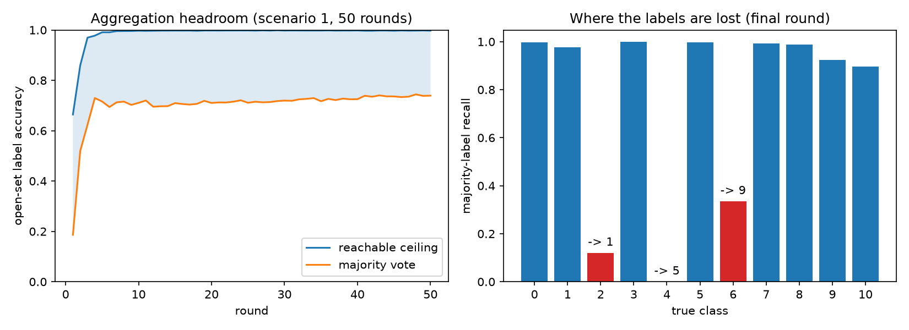

# Review of the Dawid-Skene server-side approval brief

Reviewed: `dawid_skene_server_changes.pdf` (5-page approval brief), `DAWID_SKENE_FEASIBILITY_PLAN.md`,
`DAWID_SKENE_SERVER_PSEUDOCODE.md`, `DAWID_SKENE_SERVER_ARCHITECTURE.png`, against the code on
branch `dawid-skene`.

Reviewer verdict: **scope and mechanism are correct; approve the seam, not yet the test sequence.**
Every technical claim in the brief that can be checked against the code checks out. What is missing
is (a) the measured size of the problem DS is supposed to fix, (b) an offline gate before spending
GPU-days, and (c) three safety rules the brief lists as stop conditions without giving a detector.

---

## 1. Claims verified against the code

| Brief claim | Verified | Evidence |
|---|---|---|
| Insertion point is `SSFLStrategy.aggregate_train` | yes | [ssfl.py:123-126](src/ssfl/strategies/ssfl.py:123) is the only production call of `aggregate_votes` |
| Clients already upload class `0..10` or `-1` | yes | `ABSTAIN = -1`, `np.where(familiar_mask, class_predictions, ABSTAIN).astype(np.int8)` — [protocols/ssfl.py:28](src/ssfl/protocols/ssfl.py:28), [:139](src/ssfl/protocols/ssfl.py:139) |
| `C = 11` | yes | `LABEL_MAP` has 11 entries — [data/labels.py](src/ssfl/data/labels.py) |
| `N = 8,900` open samples | yes | `open/features.npy` is `(8900, 115)` |
| 27 / 89 / 89 clients | yes | [config.py:284](src/ssfl/config.py:284) |
| Downlink is `global_labels` + `valid_mask` only | yes | [ssfl.py:146-148](src/ssfl/strategies/ssfl.py:146) |
| Exact ties take the lowest class index | yes | `winners.min()` — [protocols/ssfl.py:229](src/ssfl/protocols/ssfl.py:229) |
| Majority and DS can be given "exactly the same live proposals" | yes | dedup is by `message_id`, deterministic over `(algorithm, scenario, round, phase, sender)` — [message.py:40-46](src/ssfl/protocols/message.py:40) — so duplicate senders are dropped *before* aggregation, for both arms |
| New settings enter run identity automatically | yes | `config_hash()` excludes only path fields — [config.py:276-281](src/ssfl/config.py:276) |
| Sender-order invariance is required | yes, and non-trivial | integer voting is order-invariant; a float64 DS fit is **not**, so the sender-sorted matrix in the pseudocode is load-bearing, not stylistic |

No wire-contract change is needed. The privacy claim ("no new field crosses the network") is
structurally true, because the DS state never leaves `aggregate_train`.

---

## 2. What the brief is missing: the problem is measured now, and it is much larger than the brief implies

The brief claims no performance improvement, which is the right posture, but it also never states how
wrong the current labels are. That is measurable today from artifacts already on disk — no code
change, no training. `scripts/ds_headroom.py` pairs the sealed open-set labels with the 50 recorded
`votes_per_class` matrices of `ssfl-s1-gpu50_baseline-469254ea52f11ea0` (scenario 1, real N-BaIoT).



| Round | Majority label accuracy | Reachable ceiling | Tie rate | Errors that are near-ties | Annotators per item |
|---:|---:|---:|---:|---:|---:|
| 1 | 0.186 | 0.664 | 0.121 | 0.607 | 11.8 |
| 2 | 0.519 | 0.859 | 0.088 | 0.529 | 10.0 |
| 5 | 0.716 | 0.991 | 0.053 | 0.457 | 9.2 |
| 10 | 0.711 | 0.997 | 0.032 | 0.287 | 9.1 |
| 30 | 0.720 | 0.998 | 0.023 | 0.228 | 8.9 |
| 50 | 0.739 | 0.997 | 0.024 | 0.141 | 8.5 |
| mean | 0.703 | 0.987 | 0.031 | 0.280 | 9.0 |

"Reachable ceiling" = the fraction of items whose true class was proposed by **at least one** client.
It is a hard upper bound on any vote-based re-aggregator, DS included.

Three consequences the brief should carry:

1. **Label quality is the binding constraint, not model capacity.** The server model ends the run at
   0.7335 accuracy (`summary.json`) while the labels it distils from are 0.739 correct. The model has
   already saturated to its supervision. Aggregation is the right place to intervene.
2. **The headroom is 0.739 -> 0.997.** For ~99.7% of items *somebody* votes the true class and is
   outvoted. This is precisely the regime DS is designed for, and it is a much stronger motivation
   than the brief offers.
3. **The headroom sits where DS is weakest.** Only 14% of round-50 errors are near-ties; the rest are
   landslides. Per-class recall at round 50: class 4 (`gafgyt.tcp`) **0.000**, absorbed into class 5;
   class 2 (`gafgyt.junk`) 0.120, absorbed into class 1; class 6 (`mirai.ack`) 0.335, absorbed into
   class 9. Every other class is above 0.89. So DS must overturn *confident, correlated* majorities —
   exactly where its conditional-independence assumption is most violated. This is the experiment's
   central risk and it should be preregistered as such, with a stated minimum detectable effect and a
   stated failure result, not left as the brief's one-line "similar client models can make the same
   mistake together".

Caveat on these numbers: the recorded run's `dataset_manifest.json` hash (`f529785f…`) differs from
the local one (`54023e3e…`) — same seed, same split counts, same feature schema, but 96 differing
file checksums, so the two hosts prepared data with different library versions. Row alignment is
empirically certain (chance accuracy under misalignment is 0.092; measured is 0.739 with coherent
per-class structure), but the confirmatory numbers must be regenerated on the GPU host against its
own manifest. See finding 6.

---

## 3. Findings — changes required before the test sequence is approved

**F1. Add a Stage 0 that runs entirely offline.** The brief's first execution stage is shadow mode
inside a live run. That is GPU-days for a go/no-go that costs hours. The per-client matrix `Y` is the
only missing input, and the audit npz currently stores only `votes_per_class` — aggregated counts,
from which DS cannot be run. Sequence instead:

> **Stage 0** — dump `Y` (int8, `J x N`, ~240 KB at scenario 1) into the existing aggregation-audit
> npz for a few rounds behind the already-planned `dawid_skene_save_annotations`, on a short run.
> Fit DS offline against the sealed labels. Decide go/no-go before touching `SSFLStrategy`.

This also de-risks the estimator itself: hyperparameter screening (pseudocounts, iteration cap,
initialization) can be done offline on real annotation matrices instead of burning locked live runs.

**F2. Name the sealed-label source, and do not create one.** The brief says results "must be checked
offline against sealed labels", but `artifacts/data/open/` holds features only — there is no open
label file, and `load_open_data` passes `labels=None` ([datasets.py:80-83](src/ssfl/data/datasets.py:80)).
The labels are recoverable from `artifacts/data/audit/source_rows.parquet` (`split == "open"`,
`global_index` gives the row order; verified 900x6 + 700x5). **Do not** write an `open/labels.npy`:
it enters `dataset_manifest.json`'s checksum set, which changes the manifest hash, which changes
every `run_id` and breaks comparability with the runs already on disk.

**F3. Label switching needs a detector, not just a stop condition.** Page 5 lists "hidden class
meanings switch" as a reason to stop, and page 4 admits vote initialization "does not guarantee
against label switching" — but nothing in the design would notice. The DS likelihood is invariant to
permuting latent classes, and the output integer must literally mean the N-BaIoT class because it
becomes a distillation target. Add a deterministic post-fit check: require diagonal dominance
(`argmax_k M_j[c,k] == c`) across a preregistered majority of supported `(j, c)` pairs **and**
agreement with the majority labels above a preregistered floor; violation -> fallback to majority and
log the reason. Cheap, deterministic, and it converts a stop condition into a guardrail.

**F4. `dawid_skene_min_client_annotations: 1` is not a guard — but it stays, as a reported risk.**
Each client's confusion matrix has 110 free parameters. About 9 of 27 clients annotate any given item,
so a scenario-1 client contributes on the order of `N/3` observations spread over 121 cells —
workable, but the sparse cells are exactly the ones that decide whether a minority-class rescue
happens. Scenarios 2 and 3 have 89 clients on smaller private shards, so per-client counts fall and
those cells get noisier.

> **Decision (user, this review): keep the floor at 1; no pooled shrinkage, no client dropping.**
> The estimator stays as the brief specifies. The obligation this creates: per-client annotation
> counts must be measured and reported per scenario (they are currently unmeasured), and if a
> scenario-2/3 result later moves, sparse-client noise is a named candidate explanation that was
> accepted up front rather than discovered afterwards.

**F5. Rounds 1-2 are noise; decide the warm-up explicitly.** Majority accuracy is 0.186 at round 1 and
0.519 at round 2. A cold-start DS fit on that estimates meaningless confusions and can steer the
distillation trajectory early, when it matters most. Add `dawid_skene_warmup_rounds` (majority for
rounds < K) as a reported hyperparameter — or preregister K = 0 and show it does no harm. Either way
it must be a stated setting, not an unexamined default.

**F6. Add a bit-identity gate for shadow mode, and pin the host.** Shadow mode is only a valid control
if it perturbs nothing else. DS must consume no RNG, so a shadow run and a majority run at the same
seed must produce **bit-identical** `metrics.parquet`, not merely "the same logical labels and mask".
Assert that as a gate. Separately, the manifest divergence in section 2 shows the "pair dataset
manifest" control is currently violated across hosts: the matched comparison must run on one host with
one manifest hash, and that hash must be reported next to the results.

**F7. Sequence against `TIE_BREAK_PLAN.md`.** Both plans modify the same seam (the `aggregate_votes`
call site and the audit npz), and both target ties. Ties are 2.4-3.1% of items and only ~14% of
round-50 errors are near-ties, so confidence tie-breaking addresses a small slice that DS subsumes.
Land one, measure, then the other. Never benchmark both at once — the intervention would not be
identifiable.

**F8. Seeds: state which seed varies, and how many.** `prepare_data --seed` and
`ExperimentConfig.seed` are separate knobs. The matched comparison needs the prep seed **fixed**
(constant manifest) and only `ExperimentConfig.seed` varying, otherwise the arms no longer share an
open set. "Multiple independent seeds" is not a preregistration.

> **Decision (user, this review): scenario 1 only, 5 seeds — 10 runs (2 arms x 5 seeds).**
> Scenario 1 is where the 50-round baseline and its recorded audit data already exist, so the DS arm
> is comparable to something on disk. Scenarios 2 and 3 are conditional on scenario 1 showing an
> effect, and must not be reported as planned-and-dropped if they are never run.

---

## 4. Additions to the reported-settings table

The brief's page-4 table is otherwise sound. Add:

| Setting | Suggested | Why it must be reported |
|---|---|---|
| `dawid_skene_warmup_rounds` | 0 or 3 (F5) | early-round noise changes the whole trajectory |
| permutation check thresholds | diag-dominance fraction + majority-agreement floor (F3) | the only defence against silent class switching |
| number of seeds, and which seed varies | 5, `ExperimentConfig.seed` only; scenario 1 (F8) | preregistration requirement |
| per-client annotation counts | reported, floor stays at 1 (F4) | the accepted risk that must be visible in the results |
| dataset manifest hash + host | reported per arm (F6) | the matched-control claim depends on it |

And add to "what will be measured": per-client annotation counts, per-class **recall of the aggregated
labels** (not just macro-F1 — the failure here is three collapsed classes, which macro-F1 blurs), and
the reachable-ceiling gap, which is the honest denominator for any claimed improvement.

---

## 5. Reproducing section 2

```bash
cd "/Users/ayberkkarataban/Federated learning with psuedo labeling" && uv run python scripts/ds_headroom.py --plot DAWID_SKENE_HEADROOM.png
```
